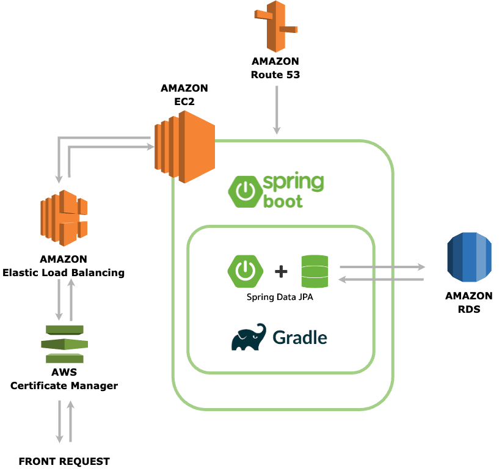

## 무료 포인트 시스템 API

  


## 프로젝트 개요
**무료 포인트 시스템 API**는 사용자의 포인트 적립, 적립 취소, 사용, 사용 취소 기능을 REST API를 통해 제어하는 포인트 관리 시스템 입니다.


## 기능
### 1. 포인트 적립
- **포인트 적립 제한**
    - 1회 적립 가능 포인트: 회원가입 시 기본적인 1회 적립 가능 포인트는 최소 1포인트 이상, 최대 100,000포인트 이하입니다.
    - 최대 보유 포인트: 사용자 별로 최대 보유가능한 포인트가 존재합니다. 기본적인 보유 가능 포인트는 150,000포인트 입니다.
    - API를 통해 사용자의 1회 적립 포인트 및 보유 상한선을 유연하게 설정할 수 있습니다.
- **거래 추적**
    - 적립과 적립 취소를 비롯하여 사용, (포인트 만료일 경과 후)사용 취소 시 1원 단위까지 추적 가능 합니다.
- **관리자 수기 적립**
    - 관리자가 수기로 포인트를 지급할 수 있으며, 수기 지급된 포인트는 다른 적립과 구분되어 식별 가능합니다.
- **만료일**
    - 모든 포인트는 최소 1일 이상, 최대 5년 미만의 만료일을 부여할 수 있습니다. (기본 365일)

### 2. 적립 취소
- **부분 취소**
    - 특정 적립 행위에서 적립한 금액만큼 취소 가능합니다.
    - 적립한 금액 중 일부가 사용된 경우, 해당 적립 포인트는 취소할 수 없습니다.

### 3. 포인트 사용
- **주문 기반 사용**
    - 주문 번호와 함께 포인트 사용 내역을 기록하여 어떤 주문에서 얼마의 포인트를 사용했는지 식별할 수 있습니다.
- **포인트 우선 사용 정책**
    - 관리자가 수기 지급한 포인트가 우선적으로 사용됩니다.
    - 만료일이 짧게 남은 포인트부터 우선적으로 사용됩니다.

### 4. 사용 취소
- **부분 및 전체 취소**
    - 사용한 포인트의 전체 또는 일부를 사용 취소할 수 있습니다.
- **만료된 포인트 재적립**
    - 사용 취소 시점에 이미 만료된 포인트를 취소해야 하는 경우, 해당 금액만큼 신규 적립 됩니다.

## 엔티티 관계 다이어그램 (ERD)


## 아키텍처 설계도


## Build (프로젝트 빌드)
1. **Clone Repository**
   ```bash
   git clone https://github.com/spo1lr/Point-API.git
   cd Point-API
   ```
   
2. **프로젝트 빌드(gradle)**
   ```bash
   ./gradlew build
   ```
   
## Run (실행)
1. **실행(gradle)**
   ```bash
   ./gradlew bootRun
   ```

## API Endpoints
### 회원
#### 1. **회원가입 `POST /api/v1/members`**
- **요청 페이로드**
  ```json
   {
       "name": "테스트"
   }
  ```

#### 2. **포인트 설정 변경 `POST /api/v1/members/{memberId}/update`**
- **요청 페이로드**
  ```json
   {
       "maxEarnPoint" : 100000,
       "maxHoldPoint" : 150000
   }
  ```
### 포인트
#### 1. **포인트 지급 `POST /api/v1/points/earn`**
- **요청 페이로드**
  ```json
    {
        "memberId": 1,
        "amount": 500,
        "isManual": true,
        "expireDays": 365
    }
  ```

#### 2. **포인트 지급 취소 `POST /api/v1/points/earn/cancel`**
- **요청 페이로드**
  ```json
    {
        "memberId": 1,
        "amount": 700
    }
  ```

#### 3. **포인트 사용 `POST /api/v1/points/use`**
- **요청 페이로드**
  ```json
    {
        "memberId": 1,
        "amount": 1200,
        "orderId": "ORDER001"
    }
  ```

#### 4. **포인트 사용 취소 `POST /api/v1/points/use/cancel`**
- **요청 페이로드**
  ```json
    {
      "memberId": 1,
      "amount": 1100,
      "orderId": "ORDER001"
    }
  ```